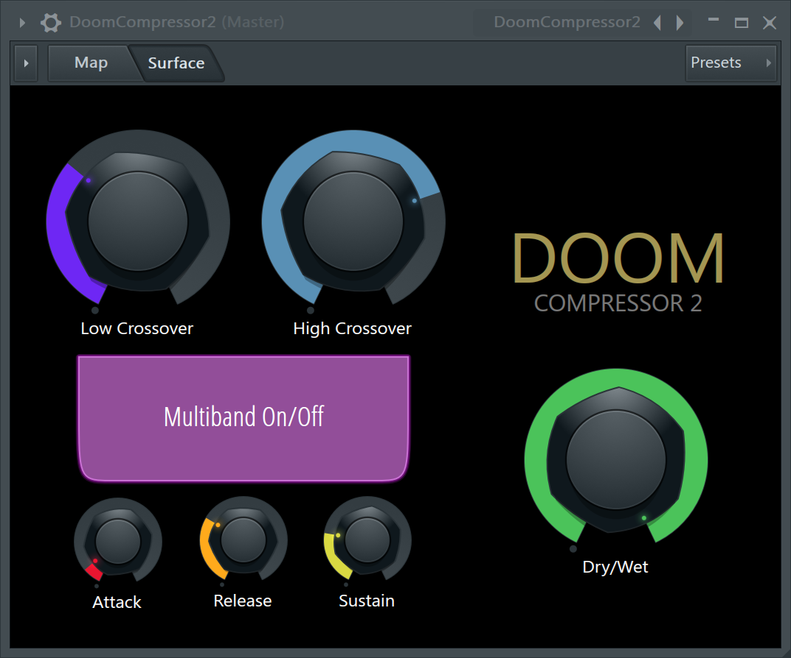
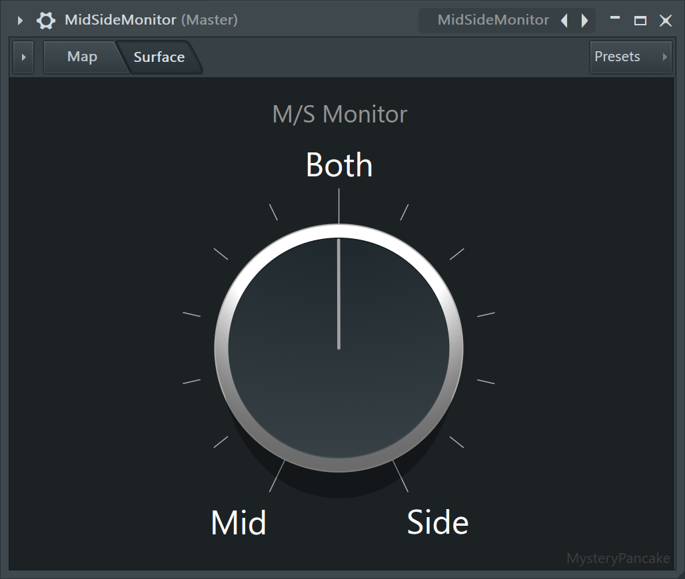
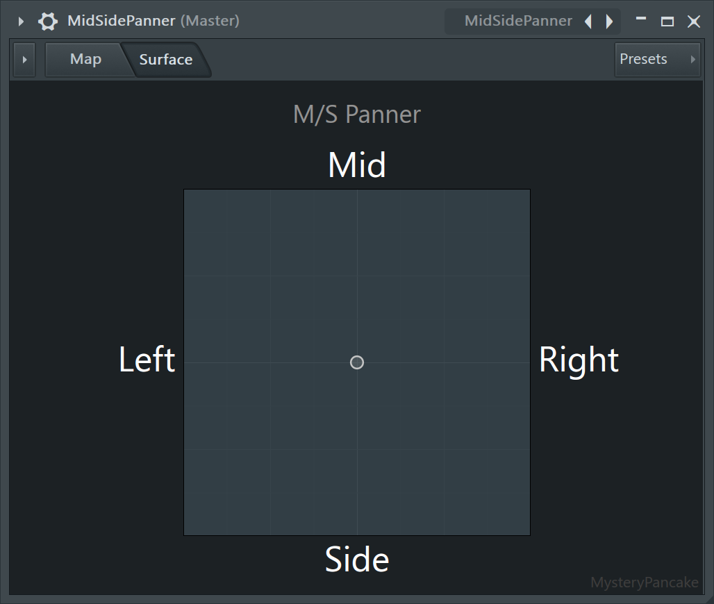
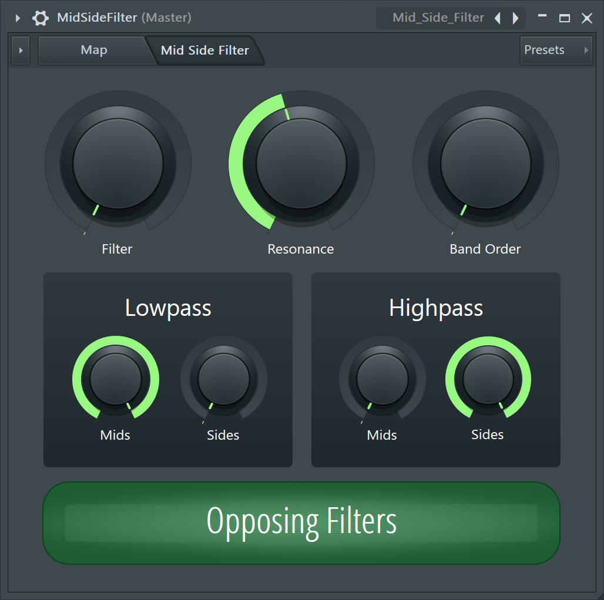
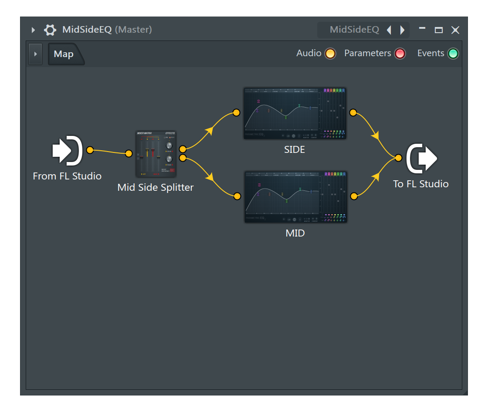

# FL Patcher Presets
Presets for FL Studio Patcher.

These presets use existing plugins to produce new effects.

## [Doom Compressor](Doom_Compressor.fst)
[Mick Gordon talked about his Doom Compressor on stream](https://www.youtube.com/watch?v=n7YJcVuxuAQ).

I recreated it using a flat curve in Maximus, which compresses everything to 0 dB.

## [Doom Compressor 2](Doom_Compressor_2.fst)
I improved the Doom Compressor by adding attack, sustain, release, and dry / wet controls.

## [Mid / Side Monitor](Mid_Side_Monitor.fst)
This single knob monitor is useful for quickly checking the contents of your mix.

## [Mid / Side Panner](Mid_Side_Panner.fst)
I improved the Mid / Side Monitor by adding left / right panning.

This is useful for spatial effects, such as moving drums close and to the right, or guitars far and to the left.

## [Mid / Side Filter](Mid_Side_Filter.fst)
This combines mid / side separation with two opposing lowpass / highpass filters for interesting spatial effects.

## [Mid / Side EQ](Mid_Side_EQ.fst)
This is identical to the default Mid/Side EQ preset, except with linear phase and oversampling enabled.

