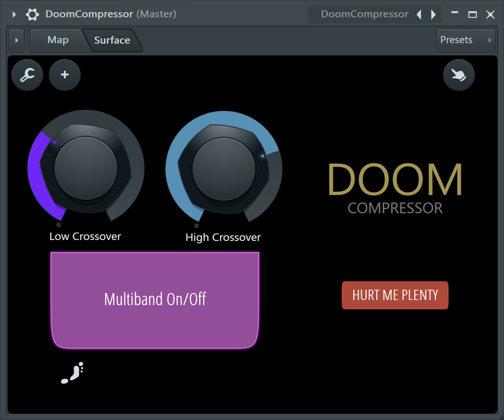
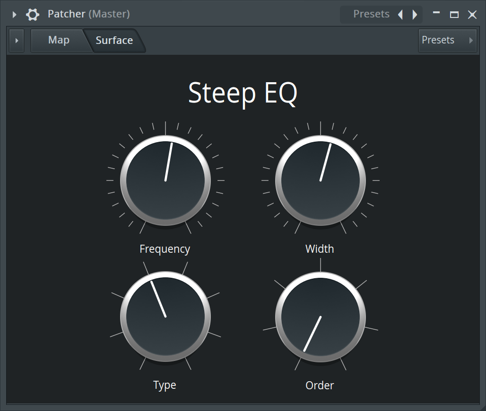
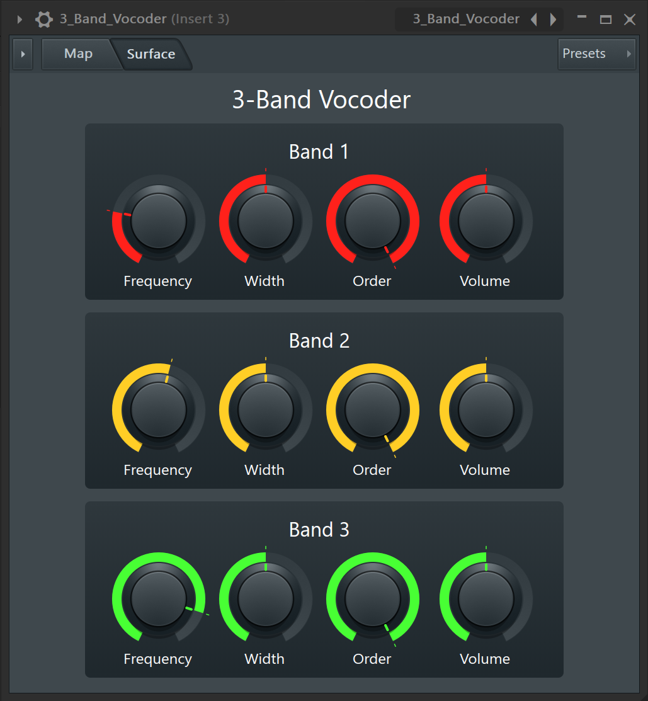
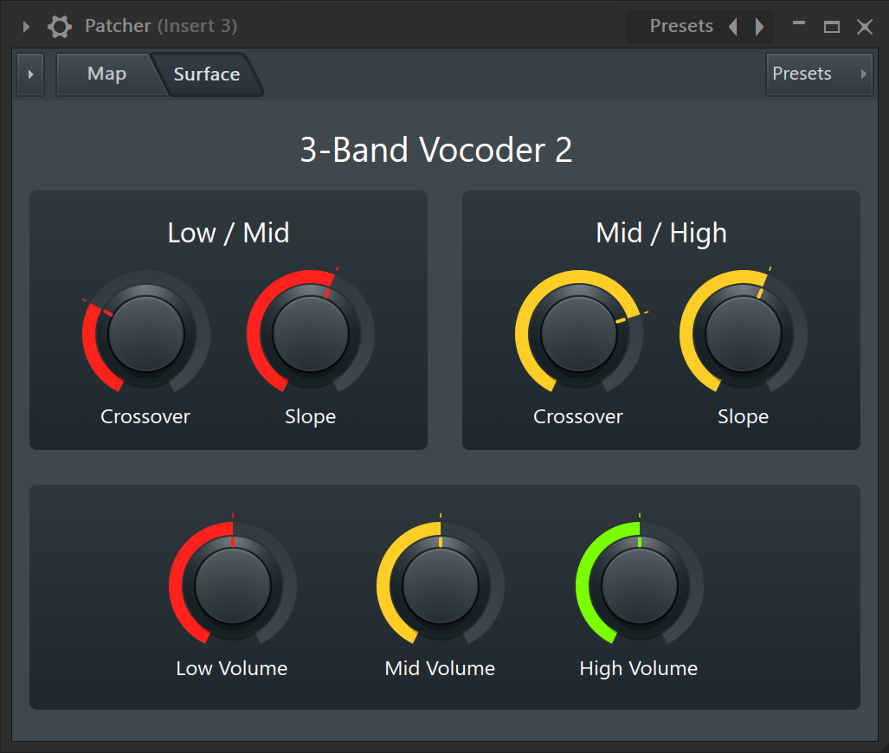

# FL Studio Presets
Presets for FL Studio plugins, mainly Patcher.

Patcher presets use existing plugins to produce new effects.

## Patcher Presets

### [Doom Compressor](Doom_Compressor.fst)
[Mick Gordon talked about his Doom Compressor on stream](https://www.youtube.com/watch?v=n7YJcVuxuAQ).

This recreates it using a flat curve in Maximus, which compresses everything to 0 dB.

### [Doom Compressor 2](Doom_Compressor_2.fst)
Improved version of the Doom Compressor which adds attack, sustain, release, and dry / wet controls.

### [Mid / Side Monitor](Mid_Side_Monitor.fst)
This single knob effect is useful for quickly checking the contents of your mix.

### [Mid / Side Panner](Mid_Side_Panner.fst)
Improved version of the Mid / Side Monitor which adds left / right panning.

This is useful for spatial effects, such as moving drums close and to the right, or guitars far and to the left.

### [Mid / Side Filter](Mid_Side_Filter.fst)
This effect combines mid / side separation with two opposing lowpass / highpass filters.

### [Mid / Side EQ](Mid_Side_EQ.fst)
This is identical to the default Mid/Side EQ preset, except with linear phase and oversampling enabled.

### [Steep EQ](Steep_EQ.fst)
Paramatric EQ with all bands locked to the same frequency, width, type and order.

### [3-Band Vocoder](3_Band_Vocoder.fst)
Basic vocoder setup with 3 bands. First sidechain input is modulator, second input is carrier.

### [3-Band Vocoder 2](3_Band_Vocoder_2.fst)
Same vocoder setup as above, but using Frequency Splitter for precise band splitting.

## Maximus Presets

### [Good Master](Good_Master.fst)
This is identical to the default Clean Master preset, except with the master limiter enabled.

## Fruity Reverb 2 Presets

### [Reverb Delay](Reverb_Delay.fst)
This reverb has minimal diffusion to produce a delay-like effect.

### [Reverb Metallic](Reverb_Metallic.fst)
This reverb has minimal decay to produce a metallic effect.

### [Reverb Squeaky](Reverb_Squeaky.fst)
This reverb has full mod depth to produce squeaky pitch slides.
